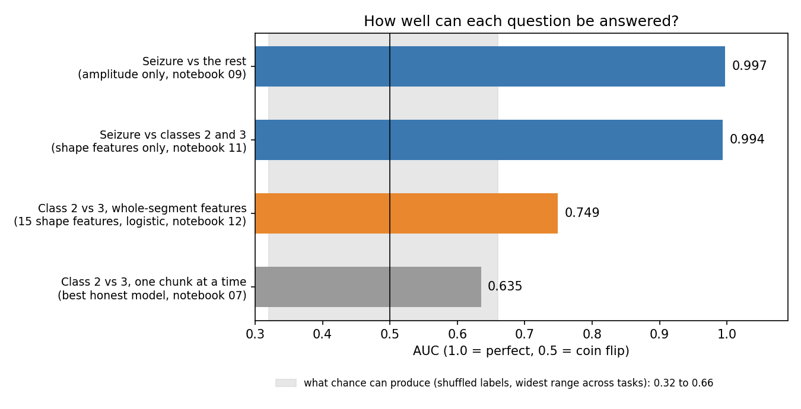
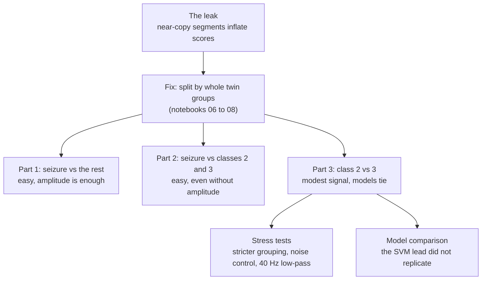
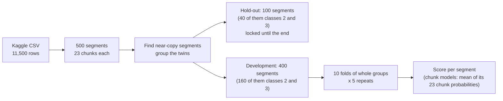
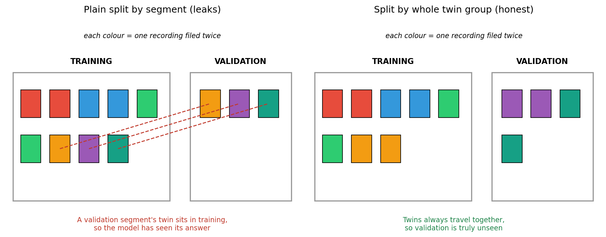
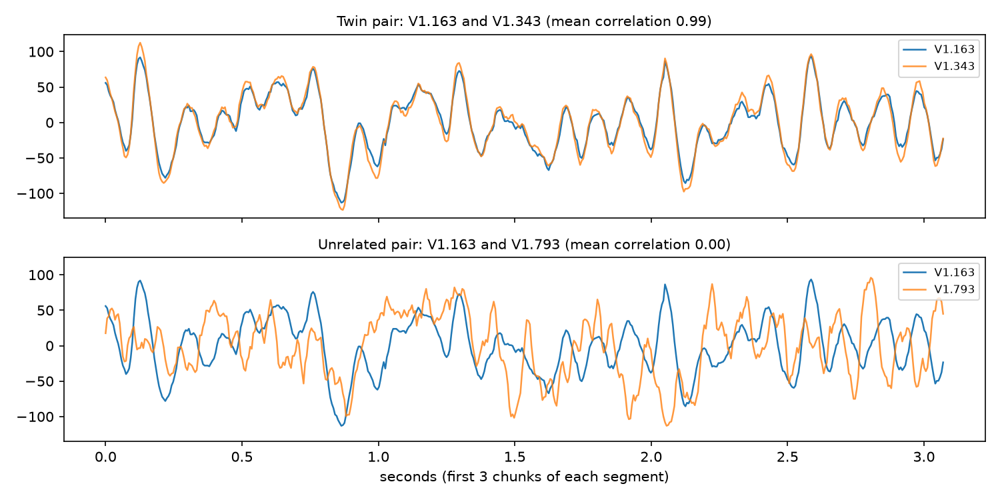
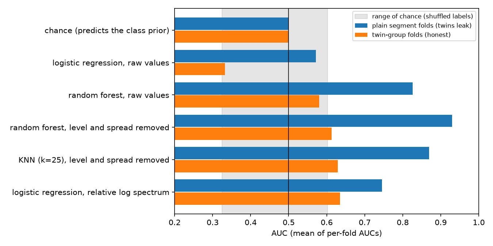
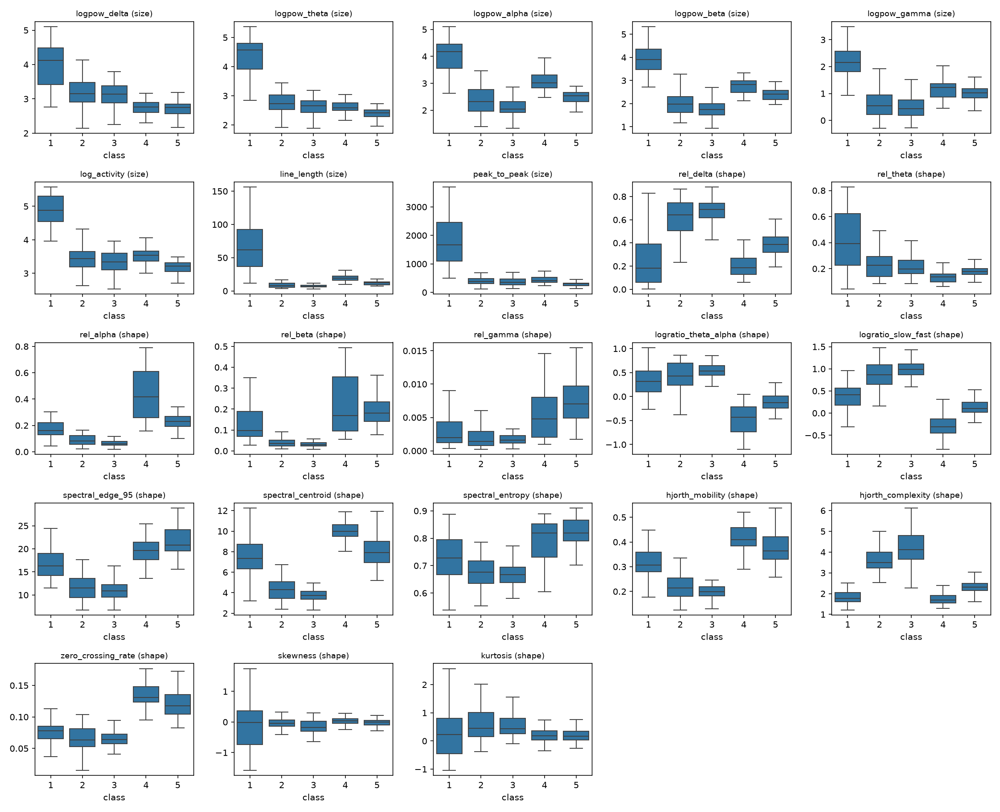
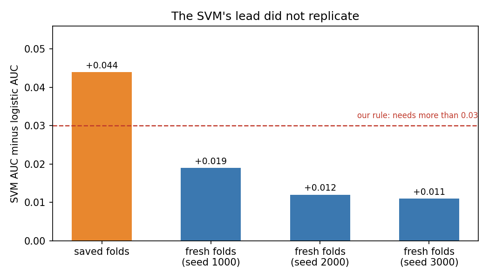

# Seizure EEG: finding a leak in my own evaluation

**In plain words.** Some of the EEG recordings in this dataset are filed twice under different IDs. If one copy ends up in training and the other in testing, a model looks far better than it is. This project finds those copies, builds splits that keep them together, and then asks three questions with honest scoring.



**In short**
- Data: Kaggle's "Epileptic Seizure Recognition" (500 EEG segments in five classes). I use Kaggle's labels; the file cannot verify what they mean.
- Main finding, about evaluation: many segments are near-copies of each other. Plain segment splits let a twin sit in training while its partner was tested, which inflated AUC from about 0.6 to 0.8-0.9. Splitting by whole twin groups fixes it.
- Seizure vs the rest is easy (AUC 0.997 from signal amplitude alone). Seizure vs Kaggle's classes 2 and 3 is easy too, even without amplitude.
- Class 2 vs 3 (Kaggle: "tumour area" vs "healthy area") is near chance with chunk-level models, but above chance with whole-segment features: AUC about 0.70 to 0.79 depending on features and model, and no model is clearly better than logistic regression. This is **not** evidence that anything detects tumours or works on new patients. See Limitations.

## Words used here
| Word | Meaning |
|---|---|
| Segment / chunk | A recording is a segment of 23.6 seconds, stored as 23 one-second chunks |
| Twins | Two segments that are the same recording filed under different IDs |
| Fold | One slice of the data held back for testing while the model trains on the rest |
| Hold-out | Segments locked away until the very end, used once |
| AUC | How well a model ranks the positive class above the negative one. 1.0 is perfect, 0.5 is a coin flip |
| Shuffled-label range | The scores a model gets by luck when the labels are randomly shuffled. Anything inside it is not evidence of signal |

## The project in one picture


## Data
- Source: Kaggle "Epileptic Seizure Recognition", a reshaped copy of the dataset from Andrzejak et al. (2001) (full citation under Licence and data). Download it into `data/raw/`; it is not stored in this repo.
- 11,500 rows = 500 **segments** x 23 one-second **chunks** (178 samples each, about 173.6 Hz). The ID column (`X<chunk>.<segment>`) gives the chunk and the segment. Chunk numbers give the time order within a segment.
- Five classes, 100 segments each. Class 1 is seizure. Kaggle labels class 2 "tumour area" and class 3 "healthy area"; both are depth-electrode recordings. Classes 4 and 5 are scalp recordings (eyes closed / eyes open).
- There is no patient ID. The original publication describes a handful of people (five patients and five healthy volunteers), not 500, so many segments probably come from the same few people. What the file itself supports is 500 segments.
- Almost no power above 40 Hz, with a narrow 50 Hz mains line. Seizure chunks are about 6x larger in amplitude.

## Evaluation design

- One prediction per segment. Headline metric: ROC-AUC, as the mean of per-fold AUCs.
- The final split (notebook 08) covers all five classes: 500 segments make 330 twin groups; the hold-out is 100 segments (20 per class, 66 groups); development is 400 segments, folds stratified by the five-class label. All models use the same saved folds in `splits/`.
- Anything learned from data (scaling, feature selection, resampling, tuning) happens inside the training fold. Tuning uses inner folds that also keep twin groups together.
- Re-making folds moves scores by up to about 0.03. I treat differences below 0.03 as ties, and a tie goes to the simpler model. A model beats another only if its mean AUC is more than 0.03 higher and it wins in every repeat.
- The shuffled-label range is what a model with no signal scores on the same folds (labels shuffled between whole twin groups).

## The leak
Segments that are the same recording sit under different IDs. If a twin is in training, the model has already seen the answer:



A real twin pair, against an unrelated pair:



- 44% of class 2 and 3 segments have a partner with mean aligned correlation above 0.8, and 22% above 0.9.
- Strong twins are always the same class, so a twin in training gives away the label of a validation segment.
- Fix: link segments above 0.7 similarity, or in a tight cluster where every pair is above 0.4, and split by whole groups.

Same data and models, only the folds differ (chunk-level, classes 2 vs 3, notebook 07):



| Model | Plain segment folds | Twin-group folds |
|---|---|---|
| Logistic regression, raw values | 0.57 | 0.33 |
| Random forest, raw values | 0.83 | 0.58 |
| Random forest, level and spread removed | 0.93 | 0.61 |
| KNN (k=25), level and spread removed | 0.87 | 0.63 |
| Logistic regression, relative log spectrum | 0.75 | 0.64 |

The shuffled-label range on the same folds is 0.32 to 0.60. Chance is 0.50.

## Results by part

### 1. Seizure vs the rest (notebooks 09, 17)
Chunk-level logistic regression, 400 development segments, 20% seizure.

| Model | AUC | PR-AUC | Sensitivity | Specificity | Accuracy |
|---|---|---|---|---|---|
| Chance | 0.500 | 0.200 | 0 | 1 | 0.800 |
| Log amplitude (one number) | 0.997 | 0.991 | 0.865 | 0.991 | 0.965 |
| Amplitude, kurtosis, line length | 0.996 | 0.988 | 0.838 | 0.991 | 0.960 |

- Amplitude alone does the job. More features add nothing, and accuracy is misleading (chance gets 0.80).
- The ranking is near perfect; the weak point is the 0.5 cut-off. About 10 of 80 seizure segments are missed. They are quieter seizures (median chunk amplitude 112, against 294 for caught seizures and 45 for non-seizure).
- Class weights, random oversampling and SMOTE (done inside the training folds) all leave AUC unchanged and, for the one-number model, move sensitivity / specificity to about 0.975 / 0.976. A lower cut-off makes the same trade: 0.3 gives 0.95 / 0.978, 0.1 gives 1.0 / 0.922 (one repeat, descriptive only).

### 2. Seizure vs Kaggle's classes 2 and 3 (notebooks 10, 11)
23 features per reconstructed segment (8 about size, 15 about shape; `src/features.py`). 240 development segments.

| | Logistic | Forest |
|---|---|---|
| All 23 features | 0.997 | 0.999 |
| Size only | 0.996 | 0.996 |
| Shape only | 0.994 | 0.993 |

Shuffled-label range: 0.35 to 0.59. It is easy even without amplitude.



### 3. Class 2 vs 3 (notebooks 12 to 16)
160 development segments, 76 twin groups.

**Signal (12).** AUC with segment features, chance 0.500:

| | Logistic | Forest |
|---|---|---|
| All 23 | 0.708 | 0.770 |
| Size only | 0.664 | 0.738 |
| Shape only | 0.749 | 0.779 |

Shuffled-label ranges top out at 0.62 to 0.66, so these are above them. Logistic on all 23 (0.708) is above its range (0.64) by about 0.07: a modest signal.

**Stress tests (13).**
- Stricter grouping (0.6/0.3 and 0.5/0.2 thresholds, new folds): scores fall by 0.02 to 0.04 and stay above chance (e.g. logistic shape 0.761, 0.737, 0.742).
- Negative control (mains and noise-floor power only): 0.386 logistic, 0.528 forest. Nothing there.
- 40 Hz low-pass, features recomputed: logistic shape 0.762, forest shape 0.794. Little changes.

**Models (14, 15).** On the 15 shape features: logistic 0.749, SVM 0.793, forest 0.779, gradient boosting 0.712. The SVM's lead looked real on the saved folds (+0.044, 5 of 5 repeats) but did not replicate on three fresh fold sets:



With nested tuning (inner twin-grouped folds, 3 repeats) no tuned model beats tuned logistic (SVM +0.010, forest -0.006), and tuning does not beat defaults. Gradient boosting is clearly worse. **Logistic regression stays.** Single-feature scores are low except `hjorth_complexity` (0.697); picking the best k features does not beat using all 23.

**Final checks (16), run once on the hold-out.**

| | Class 2 vs 3 (not clean) | Seizure vs classes 2 and 3 |
|---|---|---|
| Hold-out segments (groups) | 40 (18) | 60 (32) |
| AUC (95% interval, group bootstrap) | 0.883 (0.771 to 1.000) | 0.988 (0.952 to 1.000) |
| Sensitivity / specificity at 0.5 | 0.70 / 0.95 | 0.90 / 0.925 |

The class 2 vs 3 check is **not clean**: those 40 segments were part of the earlier chunk-level development. It also came out higher than in development (about 0.75). With 40 segments and a wide interval I read it as "above chance, size uncertain", not as a better model.

### What this does and does not show
| It shows | It does not show |
|---|---|
| Plain folds inflate AUC by 0.11 to 0.32 when twins leak, and grouping fixes it | That any model beats logistic regression on class 2 vs 3 |
| Seizure vs the rest is easy, and amplitude is enough | That anything detects tumours, or works on new patients |
| Class 2 vs 3 is above chance on whole-segment features and survives three stress tests | That the patient-overlap question is settled |

## Notebook map
| Notebook | What it does |
|---|---|
| 02 EDA | Simple segment-level measures do not separate classes 2 and 3 |
| 06 duplicates | Finds twins, regroups the original class 2/3 split |
| 07 honest baselines | Chunk-level models on twin-group folds vs plain folds, with a shuffled-label range |
| 08 seizure splits | All-class twin groups, hold-out and folds (the splits used from here on) |
| 09 seizure baselines | Seizure vs the rest, chunk-level |
| 10 features | 23 segment features and sanity checks |
| 11 seizure vs depth | Seizure vs classes 2 and 3 |
| 12 two vs three: signal | Class 2 vs 3 grid and shuffled-label ranges |
| 13 two vs three: robustness | Stricter grouping, negative control, low-pass |
| 14 two vs three: models | Single features, feature-count curve, four models, replication on fresh folds |
| 15 two vs three: tuned | Nested tuning |
| 16 final checks | One-shot hold-out check |
| 17 seizure imbalance | Class weights, oversampling, SMOTE, cut-off sweep |
| `archive/` 01, 03, 04, 05 | Record of the first, superseded run (plain segment folds; scores inflated by the leak; 01 halts on purpose) |

The reasoning behind each step is in [PROJECT_NOTES.md](PROJECT_NOTES.md).

## Reproduce
```bash
git clone https://github.com/viveka2863/seizure-epileptogenic-localisation.git
cd seizure-epileptogenic-localisation
python -m venv .venv && source .venv/bin/activate
pip install -r requirements.txt
# download the CSV from Kaggle into data/raw/ ("Epileptic Seizure Recognition.csv")
python -c "from src.data import write_processed, write_processed_allclass; write_processed(); write_processed_allclass()"
python -c "from src.features import build_feature_tables; build_feature_tables()"
jupyter lab        # run notebooks 02, then 06 to 17 in order
python reports/make_summary_figures.py    # redraws the three summary figures (numbers are copied from the notebooks)
```
The saved splits in `splits/` are the ones behind every reported number. Notebooks 06 and 08 never overwrite them. Seeds are fixed; re-running reproduces the numbers above (SVM and forest may differ in the third decimal with other library versions). Raw and processed data are not committed. Notebook 16 reads the hold-out; run it once.

## Limitations
- No patient ID, so a model may be recognising a person or recording site it has already seen. This cannot be tested here and could explain part of the class 2 vs 3 result. Nothing here says anything about tumours or new patients, and none of it is clinical.
- Twin grouping uses thresholds. Weaker similarity below them may remain, so all scores are upper bounds.
- Hold-outs are small (40 and 60 segments, 20 positives each), so they only confirm large effects.
- The chunk-level and whole-segment results answer different questions, and the segment features need all 23 chunks.
- The clips are not continuous EEG. Each segment is a short excerpt, so nothing here is about detecting seizure onset in a live recording.
- Gradient boosting and the SVM's probability calibration used defaults.

## Data and attribution
- Data: not included. Get it from Kaggle ("Epileptic Seizure Recognition") and follow the terms on its page. It is a reshaped copy of the dataset from: Andrzejak RG, Lehnertz K, Mormann F, Rieke C, David P, Elger CE (2001). Indications of nonlinear deterministic and finite-dimensional structures in time series of brain electrical activity: dependence on recording region and brain state. Physical Review E 64, 061907.

## Future work
- More feature families (catch22, MiniROCKET) and boosting libraries (XGBoost, LightGBM), compared under the same rule.
- Patient-level validation, which needs a dataset with patient IDs.
