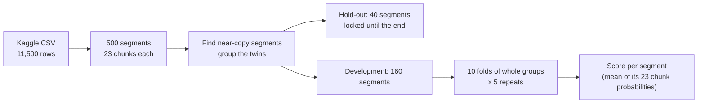

# Seizure EEG: finding a leak in my own evaluation

**In short**
- Task: classify 1-second EEG chunks from Kaggle's "Epileptic Seizure Recognition" as class 2 ("tumour area") or class 3 ("healthy area"), using Kaggle's labels.
- Main finding, about evaluation: many segments are near-copies of each other (the same recording, at the same time). Splitting by segment let a segment's twin sit in training while it was tested, which inflated AUC from about 0.6 to 0.8-0.9.
- With twin-aware evaluation, no model is clearly better than chance for class 2 vs 3. The best AUC is about 0.64, against a chance range of 0.32 to 0.60.
- Next: seizure detection (class 1 vs the rest). The effect is large there and survives the corrected evaluation.

## Data
- Source: Kaggle "Epileptic Seizure Recognition" (a reshaped copy of a published EEG dataset; see the Kaggle page for the citation). Download it into `data/raw/`; it is not stored in this repo.
- 11,500 rows = 500 **segments** x 23 one-second **chunks** (178 samples each). The ID column (`X<chunk>.<segment>`) identifies the chunk and the segment. Chunk numbers give the time order within a segment.
- Classes 2 and 3 are 200 segments (100 each).
- The CSV has no patient ID, so overlap between patients cannot be ruled out. Kaggle describes 500 individuals; what the file itself supports is 500 segments.

## Evaluation design

- One prediction per segment: its 23 chunk probabilities are averaged.
- Headline metric: ROC-AUC, as the mean of per-fold AUCs. Accuracy and a confusion matrix are reported beside it.
- Every model uses the same saved folds (`splits/`). Anything learned from data (scalers, models) is fitted on the training fold only.

## The leak
Segments that are the same recording sit under different IDs:


- 44% of segments have a partner with mean aligned correlation above 0.8, and 22% above 0.9.
- Strong twins are always the same class, so a twin in training gives away the label of a validation segment.
- Fix: group twins (above 0.7 similarity, or in a tight cluster where every pair is above 0.4) and split by whole groups. 200 segments form 94 groups. After the fix, the most similar hold-out/dev pair is 0.67 and the most similar validation/training pair is 0.65.

Same data and models, only the folds differ:


| Model | Plain segment folds | Twin-group folds |
|---|---|---|
| Logistic regression, raw values | 0.57 | 0.33 |
| Random forest, raw values | 0.83 | 0.58 |
| Random forest, level and spread removed | 0.93 | 0.61 |
| KNN (k=25), level and spread removed | 0.87 | 0.63 |
| Logistic regression, relative log spectrum | 0.75 | 0.64 |

The grey band is the range of AUC you get with shuffled labels on the same folds (0.32 to 0.60).

## Notebooks
| Notebook | What it does | Status |
|---|---|---|
| 01 audit | Checks the data structure, makes the first split | Superseded (halts on purpose) |
| 02 EDA | Simple segment-level measures do not separate the classes | Valid |
| 03 splits | Folds by segment | Superseded |
| 04 baselines | First models | Scores inflated by the leak |
| 05 ablation | What the forest relied on | Interpretation superseded: it was matching twins |
| 06 duplicates | Finds twins, regroups the hold-out and folds | The fix |
| 07 honest baselines | Models on the corrected folds, with a chance range | Current |

## Reproduce
```bash
git clone https://github.com/viveka2863/seizure-epileptogenic-localisation.git
cd seizure-epileptogenic-localisation
python -m venv .venv && source .venv/bin/activate
pip install -r requirements.txt
# download the CSV from Kaggle into data/raw/
python -c "from src.data import write_processed; write_processed()"
jupyter lab        # run notebooks 02, 06 and 07
# Notebooks 04 and 05 are kept as a record of the superseded run. Notebook 06 re-derives the splits; the committed files in `splits/` are the ones behind the reported results.
```

## Limitations
- Similarity between segments is graded, so weaker twins below the thresholds may remain. Scores should be read as upper bounds.
- The hold-out has only 18 groups, so it can only confirm a large effect.
- No patient ID, so patient-level overlap is untested.
- Differences below about 0.05 AUC are within noise.

## Next
Seizure detection (class 1 vs the rest), where the effect should be much larger. It will be tested with the same twin-aware evaluation.